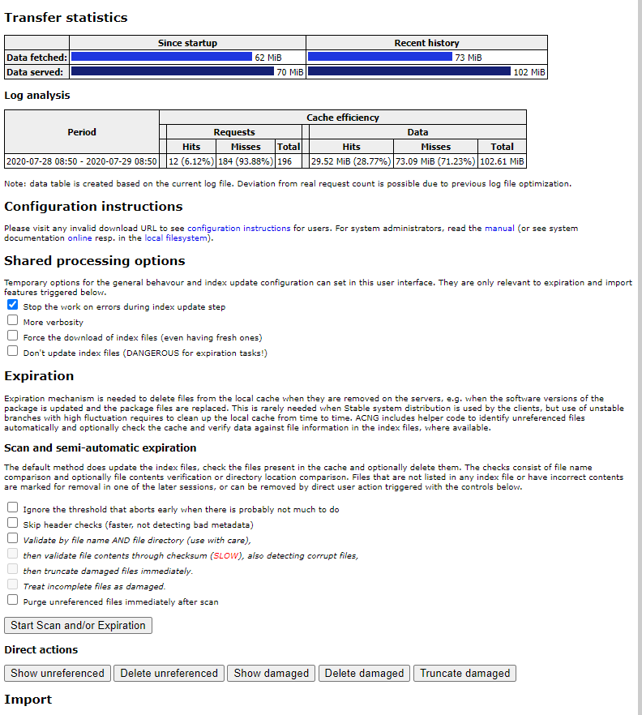

## APT-CACHE-NG là gì

apt-cache-ng là một caching proxy server, nó thực hiện "cache" các gói khi download từ internet về và đặt tại server để tái sử dụng cho các lần cài đặt sau. Nhờ vậy, các máy khác sau này khi cần cài đặt thì sẽ không mất thời gian để tải gói từ internet về nữa.

Chưa rõ tại sao có cái APT trong tên, có lẽ lúc đầu chương trình này được viết để cache các gói cho dòng Debian, nhưng hiện tại, nó có thể được sử dụng để cache cho rất nhiều các dòng HĐH khác nhau.

Một số ưu điểm khi sử dụng:
- Tiết kiệm thời gian (hiển nhiên rồi)
- Tiết kiệm băng thông

Ngoài ra, người dùng có thể tích hợp dữ liệu từ file ISO hoặc DVD vào apt-cache-ng bằng cách sử dụng tùy chọn "import". 


## Cài đặt

Tôi sử dụng một máy chủ Ubuntu 18.04 để cài đặt chương trình này, có thể sử dụng HĐH khác như CentOS để cài đặt.

Chạy lệnh sau để thực hiện cài đặt

```sh
apt install apt-cacher-ng -y
```

Việc cài đặt diễn ra khá nhanh, không phải cài đặt thêm bất kỳ gói nào khác.

## Cấu hình

Sau khi cài đặt xong, thực hiện chỉnh sửa file cấu hình sau để có thể sử dụng làm "cache" cho HĐH CentOS 8.

Mở file cấu hình

```sh
vi /etc/apt-cacher-ng/acng.conf
```

Bỏ qua các dòng comment bắt đầu bằng dấu "#", ta cần quan tâm tới một số dòng cấu hình sau:

```sh
CacheDir: /var/cache/apt-cacher-ng
LogDir: /var/log/apt-cacher-ng
SupportDir: /usr/lib/apt-cacher-ng
Remap-debrep: file:deb_mirror*.gz /debian ; file:backends_debian # Debian Archives
Remap-uburep: file:ubuntu_mirrors /ubuntu ; file:backends_ubuntu # Ubuntu Archives
Remap-cygwin: file:cygwin_mirrors /cygwin # ; file:backends_cygwin # incomplete, please create this file or specify preferred mirrors here
Remap-sfnet:  file:sfnet_mirrors # ; file:backends_sfnet # incomplete, please create this file or specify preferred mirrors here
Remap-alxrep: file:archlx_mirrors /archlinux # ; file:backend_archlx # Arch Linux
Remap-fedora: file:fedora_mirrors # Fedora Linux
Remap-epel:   file:epel_mirrors # Fedora EPEL
Remap-slrep:  file:sl_mirrors # Scientific Linux
Remap-gentoo: file:gentoo_mirrors.gz /gentoo ; file:backends_gentoo # Gentoo Archives
Remap-centos: file:centos_mirrors /centos
ReportPage: acng-report.html
ExThreshold: 4
VfilePatternEx: ^(/\?release=[0-9]+&arch=.*|.*/RPM-GPG-KEY-examplevendor|.*)$
LocalDirs: acng-doc /usr/share/doc/apt-cacher-ng
PassThroughPattern: (mirrors\.fedoraproject\.org|some\.other\.repo|yet\.another\.repo):443
PassThroughPattern: .*
PassThroughPattern: (archive\.ubuntu\.com|security\.ubuntu\.com|packages\.get\.docker\.com):443$
PassThroughPattern: ^(.*):443$
```

Dòng cấu hình:

- `CacheDir`: Nơi chứa các gói được tải về từ internet để tái sử dụng cho các lần cài đặt sau
- `LogDir`: Lưu trữ logfile để xem việc tải gói diễn ra như thế nào 
- `Remap-`: Các loại mirror được thêm vào để lưu trữ cache
- `ReportPage`: đây là một trang báo cáo lại trạng thái download, cache, miss về các package trong quá trình hoạt động
- `ExThreshold`: Số ngày được xem xét để xóa các tập tin hết hạn.

Một số cấu hình được thiết lập thêm:

- `VfilePatternEx`: Nếu việc tìm kiếm các package không có trong list mirror, sẽ báo lỗi `403 Forbidden`, nên cần thiết lập cấu hình này để khắc phục. Ví dụ tải các GPG key thông qua proxy.
- `PassThroughPattern`: Thiết lập này cho phép cache các package đặt ở các repo sử dụng kết nối https

- Thêm dòng cấu hình `Remap-centos: file:centos_mirrors /centos` để cache cho các gói của HĐH CentOS
- Tạo thêm mirror list cho CentOS bằng lệnh:

```sh
curl https://www.centos.org/download/full-mirrorlist.csv | sed 's/^.*"http:/http:/' | sed 's/".*$//' | grep ^http >/etc/apt-cacher-ng/centos_mirrors
```

Sau khi hoàn thành việc chỉnh sửa cấu hình, thực hiện khởi động lại tiến trình và cho phép tiến trình khởi động cùng HĐH.

```sh
systemctl start apt-cacher-ng
systemctl enable apt-cacher-ng
systemctl status apt-cacher-ng
```

apt-cache-ng sử dụng port 3142 để các client kết nối tới, nên yêu cầu phải mở port 3142 trên firewall.

Trên Ubuntu thì mở firewall như sau:

```sh
ufw allow 3142/tcp
ufw reload
```

## Sử dụng làm cache cho Ubuntu

Đối với client là các máy chủ Ubuntu, ta tạo một file cấu hình proxy một cách thủ công như sau:

```sh
echo 'Acquire::http { Proxy "http://52.191.132.95:3142"; };' > /etc/apt/apt.conf.d/01proxy
```

## Sử dụng làm cache cho CentOS

Trên máy chủ CentOS8, muốn sử dụng cache thì ta cần sửa file sau `/etc/yum.conf` và thêm vào một dòng cấu hình:

```sh
echo "proxy=http://52.191.132.95:3142" >> /etc/yum.conf
```

Lưu ý là thay IP cho phù hơp


## Xem báo cáo

Truy cập vào địa chỉ sau dể xem trạng thái hoạt động của apt-cache-ng

```sh
http://52.191.132.95:3142/acng-report.html
```

Giao diện như sau:



## Thiết lập bảo mật

Có thể thiết lập bảo mật cho trang report khi cần Count Data bằng cách thêm cấu hình sau vào file `/etc/apt-cacher-ng/security.conf`

```sh
vim /etc/apt-cacher-ng/security.conf
==>
AdminAuth: sysadmins:redhat
```

Ngoài ra, có thể thiết lập Access Control Lists để cho phép/ngăn chặn sử dụng apt-caher bằng cách cấu hình hosts.allow và hosts.deny

Ví dụ:

Cho phép host 192.168.1.17 và toàn bộ dải network 192.168.43.0/24 sử dụng apt-cache-ng bằng cách bổ sung cấu hình vào file `/etc/hosts.allow`: 

```sh
apt-cacher-ng : 192.168.1.17 192.168.43.0/24
```

Hoặc chặn toàn bộ network `192.168.43.0/24` ngoại trừ host `192.168.43.27`:

Điền vào file `/etc/hosts.deny` dòng:

```sh
apt-cacher-ng : 192.168.43.0/24
```
 Và điền vào file `/etc/hosts.allow` dòng:

```sh
apt-cacher-ng : 192.168.43.27
```


## Tham khảo

- https://kifarunix.com/how-to-setup-apt-caching-server-using-apt-cacher-ng-on-ubuntu-18-04/
- https://blog.cloud365.vn/linux/Cai-dat-apt-cache-ng-lam-local-repos/
- https://www.pitt-pladdy.com/blog/_20150720-132951_0100_Home_Lab_Project_apt-cacher-ng_with_CentOS/


